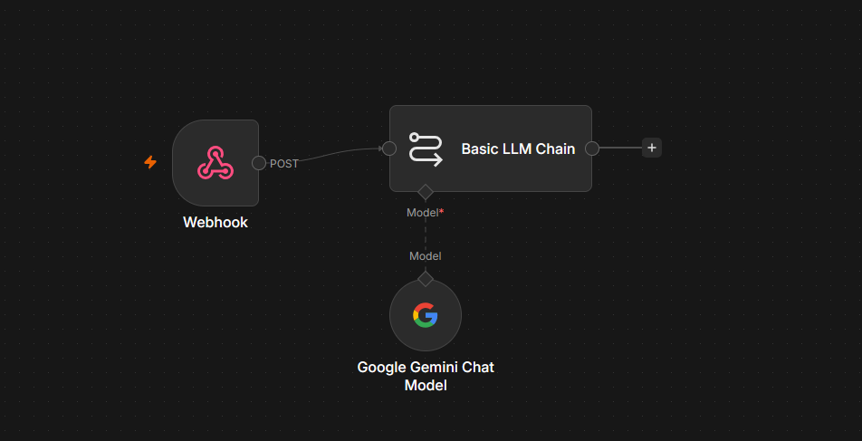

# 🌤️ Assistente de Clima Inteligente com Python & n8n

O **Assistente de Clima Inteligente** é uma aplicação interativa de linha de comando (CLI) desenvolvida em Python que realiza consultas meteorológicas em tempo real e utiliza automações inteligentes para sugerir recomendações personalizadas. 

O sistema integra-se com a API do **OpenWeatherMap** para obter dados climáticos precisos de qualquer cidade e se conecta a um fluxo de automação no **n8n** integrado com Inteligência Artificial para gerar dicas dinâmicas (como sugestões de roupas, atividades ou cuidados de saúde) com base no clima atual.

---

## 🚀 Funcionalidades

*   **Consulta de Clima em Tempo Real:** Obtenção de temperatura, umidade e descrição climática de qualquer cidade por meio da OpenWeather API.
*   **Recomendações com IA:** Integração via Webhook com o **n8n** para processamento de IA generativa, fornecendo dicas de vestuário e atividades sob medida para o clima da cidade.
*   **Mecanismo de Fallback (Simulação):** Se a API do n8n estiver inacessível ou o Webhook não estiver configurado, o app executa uma lógica de simulação inteligente local para não interromper a experiência do usuário.
*   **Histórico de Consultas:** Persistência das últimas 50 consultas em um arquivo estruturado no formato JSON (`historico.json`).
*   **Registro de Erros (Logs):** Gravação automática de logs de erros e falhas de conexão em um arquivo `.txt` (`erros.txt`) para facilidade de depuração.

---

## 🛠️ Arquitetura do Projeto

O projeto é estruturado de forma modular para garantir manutenibilidade e separação de responsabilidades:

*   **[`main.py`](main.py):** Orquestrador principal da aplicação. Gerencia o loop da interface de terminal, valida as entradas do usuário, invoca os serviços e exibe as respostas formatadas.
*   **[`clima_api.py`](clima_api.py):** Módulo de conexão com a API do OpenWeatherMap. Valida a chave de acesso no `.env`, trata as requisições e normaliza os dados de resposta.
*   **[`n8n_integration.py`](n8n_integration.py):** Módulo responsável pela comunicação HTTP POST com o Webhook do n8n. Contém o tratamento de timeouts e a lógica de fallback da IA simulada localmente.
*   **[`gerenciador_arquivos.py`](gerenciador_arquivos.py):** Camada de persistência. Contém as funções para salvar/carregar dados em `historico.json` e registrar mensagens de erro com data e hora em `erros.txt`.
*   **[`n8n_workflow_CORRIGIDO.json`](n8n_workflow_CORRIGIDO.json):** Arquivo de exportação do workflow do n8n pronto para importação na sua instância do n8n.

---

## 🤖 Fluxo de Automação no n8n

O fluxo de trabalho configurado no **n8n** recebe os dados da consulta climática enviada pelo Python, envia-os para uma Inteligência Artificial para que ela produza uma recomendação de forma contextualizada, e retorna a resposta formatada para o terminal do usuário.

Abaixo está o design do fluxo implementado no n8n:



### Estrutura do Fluxo:
1.  **Webhook Node (Gatilho):** Escuta requisições do tipo `POST` enviadas pelo script Python contendo dados estruturados em JSON (cidade, temperatura, descrição, umidade).
2.  **Basic LLM Chain / AI Node:** Envia as informações meteorológicas para o modelo de linguagem (LLM) configurado no n8n com instruções customizadas de prompt (system prompt).
3.  **Webhook Response Node:** Retorna a recomendação gerada pela IA de volta ao script Python em formato JSON.

---

## 🔧 Pré-requisitos e Instalação

### 1. Clonar o Repositório e Navegar até a Pasta
```bash
git clone <URL_DO_SEU_REPOSITORIO>
cd ProjetoPython
```

### 2. Configurar o Ambiente Virtual (Recomendado)
```bash
# Criar ambiente virtual
python -m venv venv

# Ativar ambiente virtual
# No Windows:
venv\Scripts\activate
# No Linux/macOS:
source venv/bin/activate
```

### 3. Instalar Dependências
Instale as bibliotecas necessárias declaradas no projeto:
```bash
pip install requests python-dotenv
```

### 4. Configurar as Variáveis de Ambiente
Crie um arquivo chamado `.env` na raiz do projeto (o arquivo original é ignorado pelo Git por questões de segurança):
```env
OPENWEATHER_API_KEY=sua_chave_da_api_openweather
N8N_WEBHOOK_URL=sua_url_de_webhook_do_n8n
```

> **Nota:** Se você não configurar a `N8N_WEBHOOK_URL`, o sistema usará automaticamente a simulação local de IA para fins de demonstração.

---

## 💻 Como Executar

Com as chaves configuradas no `.env` e as dependências instaladas, basta executar:

```bash
python main.py
```

### Exemplo de Uso:
```text
========================================
      ASSISTENTE DE CLIMA INTELIGENTE
========================================
1. Consultar Clima de uma Cidade
2. Ver Histórico de Consultas
3. Sair
========================================
Escolha uma opção: 1

Digite o nome da cidade: São Paulo

Buscando informações para São Paulo...
Consultando Inteligência Artificial...

------------------------------
CIDADE: São Paulo
TEMPERATURA: 18.5°C
CONDIÇÃO: Nublado
UMIDADE: 75%
------------------------------
IA Sugere: O tempo está fresco e nublado em São Paulo. Recomendo levar um agasalho leve se for sair de casa e, caso tenha atividades ao ar livre planejadas, fique atento a possíveis chuvas finas.
------------------------------
```

---

## 🔒 Boas Práticas de Segurança Aplicadas

*   **Exclusão de Credenciais:** O arquivo `.env` contendo as chaves de API e URLs do Webhook privado está adicionado ao `.gitignore` para impedir que dados sensíveis sejam enviados acidentalmente ao GitHub.
*   **Isolamento de Logs e Dados Locais:** O histórico de buscas (`historico.json`) e os logs de erros (`erros.txt`) também estão inclusos no `.gitignore` para evitar o vazamento de informações de consulta do usuário no repositório.
*   **Tratamento de Exceções:** Todos os módulos de comunicação de rede possuem tratamentos de erro estruturados com logs anônimos para evitar exposição de caminhos do sistema operacional local (stack traces completos).
